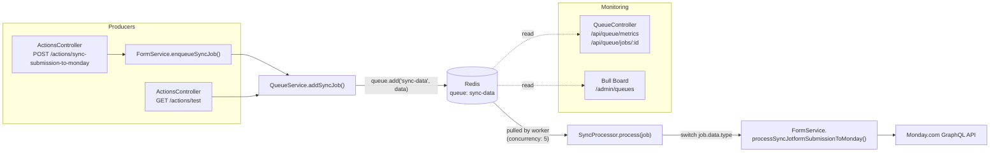
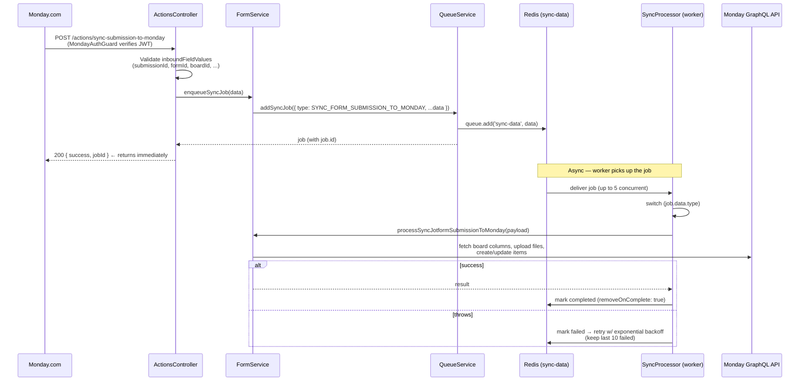
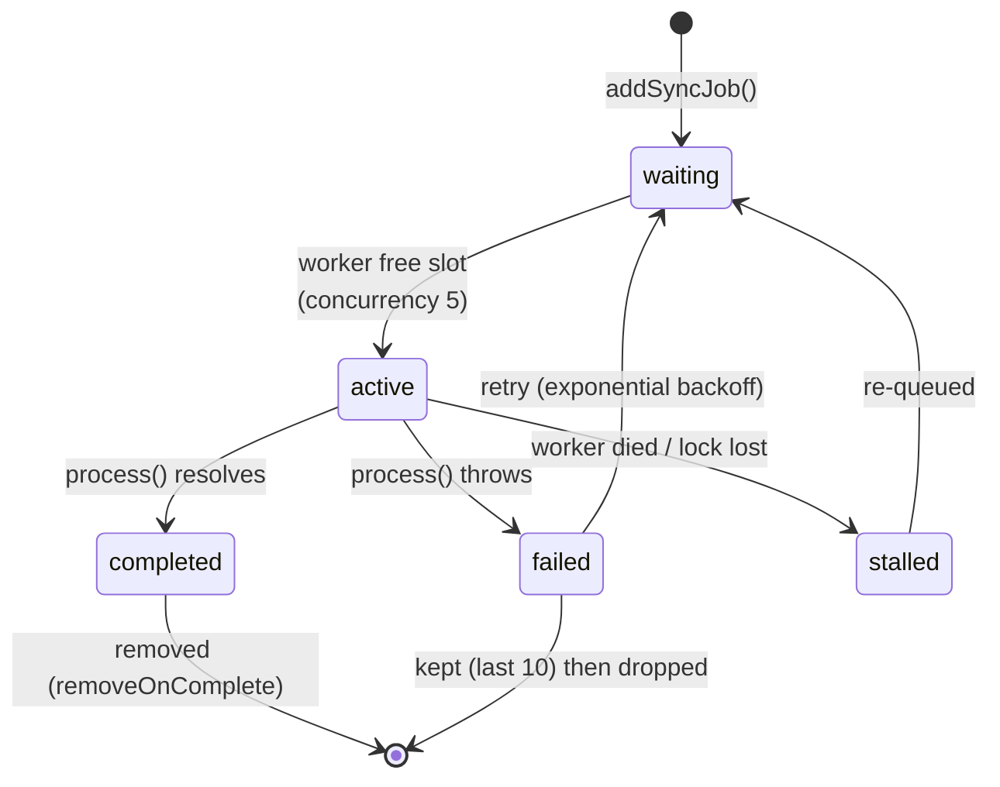

# Queue System (BullMQ + Redis)

This project uses [BullMQ](https://docs.bullmq.io/) on top of Redis for background job
processing, wired into NestJS via [`@nestjs/bullmq`](https://docs.nestjs.com/techniques/queues).
The main use case is offloading the **Jotform submission → Monday.com sync** so the HTTP
request returns immediately while the heavy work (Monday API calls, file uploads) runs async.

---

## 1. Components at a glance

| Concern | Where | Notes |
|---|---|---|
| Redis connection | `src/app.module.ts` → `BullModule.forRootAsync` | Reads `REDIS_HOST` / `REDIS_PORT` / `REDIS_PASSWORD` |
| Queue registration | `src/modules/queue/queue.module.ts` → `BullModule.registerQueue` | Queue name `sync-data`, default job options |
| Queue name / job types | `src/common/constants/queue.constant.ts` | `QUEUE_NAMES`, `QUEUE_JOB_TYPES` |
| Producer (enqueue) | `src/modules/queue/queue.service.ts` → `addSyncJob()` | Called by controllers/services |
| Consumer (worker) | `src/modules/form/sync.processor.ts` → `SyncProcessor` | `@Processor`, concurrency 5 |
| Job handler logic | `src/modules/form/form.service.ts` → `processSyncJotformSubmissionToMonday()` | Actual Monday sync work |
| Monitoring API | `src/modules/queue/queue.controller.ts` | `GET /api/queue/metrics`, `GET /api/queue/jobs/:jobId` |
| Bull Board UI | `src/main.ts` | `/admin/queues` (guarded by `?secret=`) |
| Scheduled cron | `src/modules/tasks/tasks.service.ts` | Daily midnight `syncData()` (currently a no-op) |

---

## 2. Environment setup

### 2.1 Required env vars

```bash
# Redis connection (used by BullModule.forRootAsync)
REDIS_HOST=localhost      # default: localhost
REDIS_PORT=6379           # default: 6379
REDIS_PASSWORD=           # optional, leave empty for local

# Bull Board monitoring UI
ENABLE_QUEUE_BOARD=false  # 'true' to force-enable; auto-on in development
APP_SECRET=your-secret    # required as ?secret= to access /admin/queues
```

All of these are validated at boot by `src/config/env.validation.ts` (Joi). Missing required
values throw on startup.

### 2.2 Run Redis locally

```bash
# Docker (simplest)
docker run -d --name pharmacy-redis -p 6379:6379 redis:7-alpine

# verify
docker exec -it pharmacy-redis redis-cli ping   # -> PONG
```

### 2.3 Start the app

```bash
npm install
npm run start:dev
```

On boot you should see:

```
Queue monitoring board enabled at /admin/queues
<App> is listening on port <PORT> in development mode
```

The worker (`SyncProcessor`) starts automatically with the Nest app — there is **no separate
worker process**. Producer and consumer live in the same process.

---

## 3. Architecture



**Key point:** producers and the consumer never talk directly. They communicate only through
the `sync-data` queue in Redis. The queue decouples the fast HTTP path from the slow sync work.

---

## 4. End-to-end data flow (Jotform → Monday sync)



---

## 5. Job lifecycle & retry behaviour

Default job options are set once in `queue.module.ts`:

```ts
defaultJobOptions: {
  backoff: { type: 'exponential', delay: 1000 }, // 1s, 2s, 4s, ...
  removeOnComplete: true,                         // don't keep succeeded jobs
  removeOnFail: 10,                               // keep only last 10 failed jobs
}
```



> Note: `addSyncJob()` currently passes no `attempts` option, so BullMQ defaults to **1
> attempt** (no automatic retry) — the `backoff` config only takes effect if you add
> `attempts > 1`. Set `attempts` in `QueueService.addSyncJob()` or the job options if retries
> are desired.

Worker events are logged in `sync.processor.ts` via `@OnWorkerEvent`: `completed`, `failed`,
`stalled`, `error`.

---

## 6. Job types

Defined in `src/common/constants/queue.constant.ts`. The worker routes on `job.data.type`:

| `job.data.type` | Handler | Purpose |
|---|---|---|
| `SYNC_FORM_SUBMISSION_TO_MONDAY` | `FormService.processSyncJotformSubmissionToMonday()` | Sync a Jotform submission into a Monday board (columns + file uploads) |
| `TEST` | no-op (returns) | Smoke test |
| *(other / undefined)* | returns `{ success: true }` | Default branch |

---

## 7. Producing a job

```ts
// inject QueueService, then:
await this.queueService.addSyncJob(
  {
    type: QUEUE_JOB_TYPES.SYNC_FORM_SUBMISSION_TO_MONDAY,
    submissionId,
    formId,
    formQuestions,
    itemMapping,
    boardId,
    userId,
    mondayAccessToken,
  },
  { priority: 0, delay: 0 }, // optional
);
```

`FormService.enqueueSyncJob()` is the typed convenience wrapper used by the actions controller.

---

## 8. Monitoring

### 8.1 Bull Board UI

- URL: `http://localhost:<PORT>/admin/queues`
- Enabled when `ENABLE_QUEUE_BOARD=true` **or** `NODE_ENV=development`.
- Protected by a secret query param when `APP_SECRET` is set:
  `http://localhost:<PORT>/admin/queues?secret=<APP_SECRET>`
- Lets you inspect waiting / active / completed / failed / delayed jobs and retry them.

### 8.2 Metrics API

```bash
# Aggregate counts + detailed stats (no auth)
GET /api/queue/metrics

# Single job status (MondayAuthGuard — needs Monday JWT)
GET /api/queue/jobs/:jobId
```

`getDetailedQueueStats()` returns `{ waiting, active, completed, failed, delayed, paused, total }`.

---

## 9. Scheduled tasks

`src/modules/tasks/tasks.service.ts` runs `syncData()` daily at midnight via `@Cron`
(`@nestjs/schedule`). `syncData()` is currently a no-op placeholder migrated from the Express
app — fill it in if a periodic full sync is needed.

---

## 10. Troubleshooting

| Symptom | Likely cause | Fix |
|---|---|---|
| App fails to boot, Redis errors | Redis not running / wrong host:port | Start Redis; check `REDIS_HOST`/`REDIS_PORT` |
| Jobs enqueue but never process | Worker not started / wrong queue name | Ensure `QueueModule` imported in `AppModule`; queue name must match `sync-data` |
| `/admin/queues` returns 401 | Missing/invalid secret | Append `?secret=<APP_SECRET>` |
| `/admin/queues` 404 in prod | Board disabled | Set `ENABLE_QUEUE_BOARD=true` |
| Failed jobs not retrying | `attempts` defaults to 1 | Add `attempts` to job options (see §5) |
| Jobs pile up in `active` | Downstream (Monday API) slow/erroring | Check `failed`/`stalled` logs; raise concurrency carefully |
